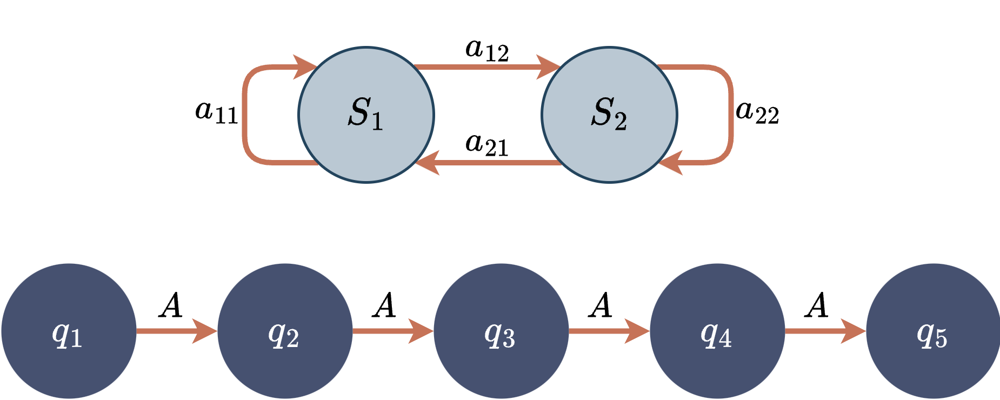
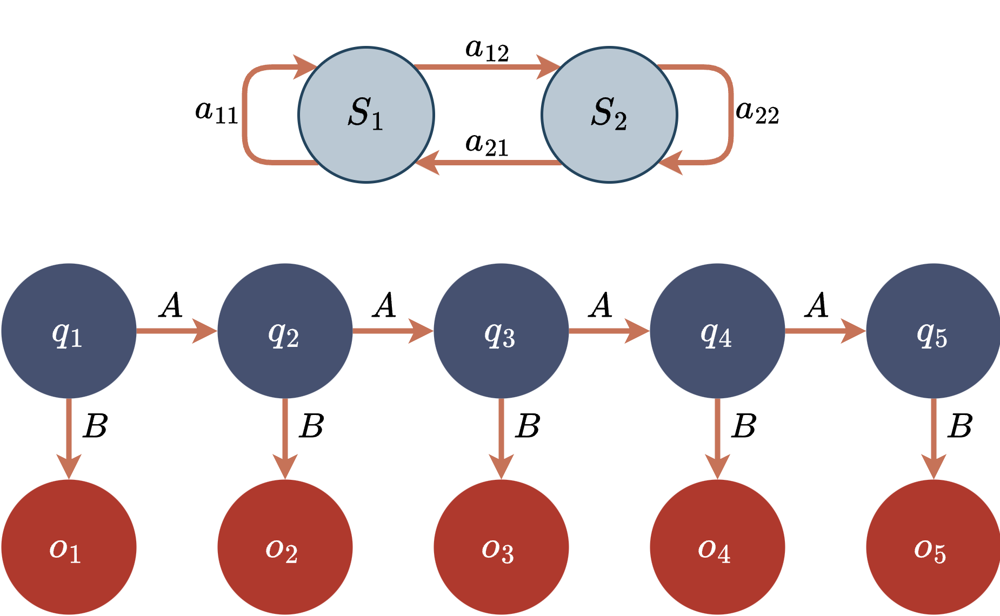
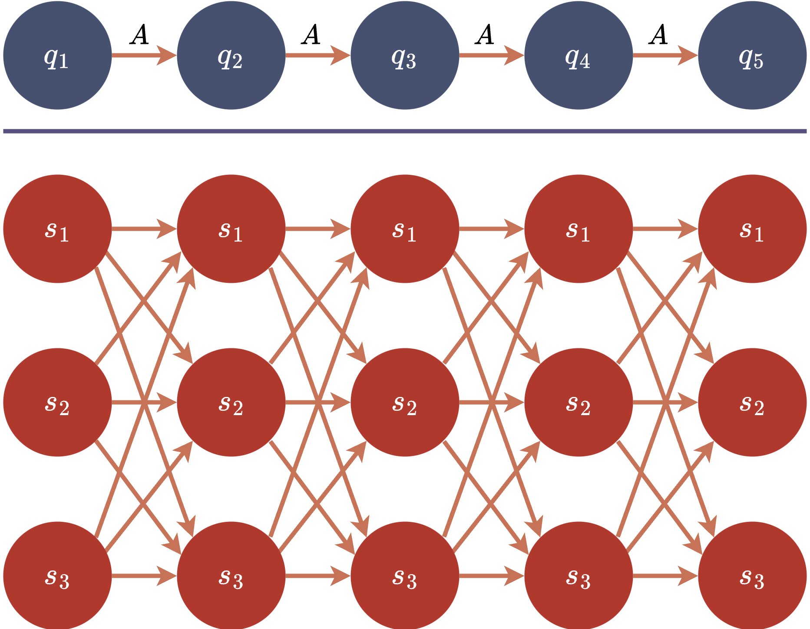
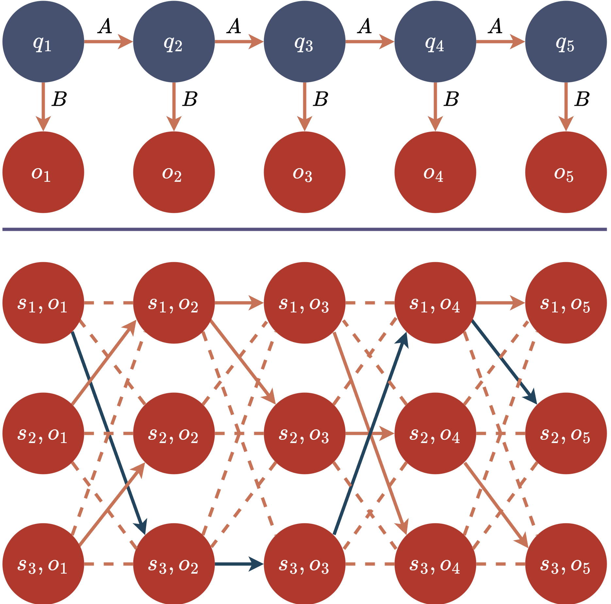

# 摘要
本实验报告旨在通过命名实体识别（NER）任务，深入理解隐马尔科夫模型（HMM）的基本原理和应用。实验包括构建 NER 任务的 HMM 模型、模型参数的估计和使用维特比算法进行状态序列的推断。实验结果表明，HMM在处理序列数据时具有较高的效率和可解释性，但由于其对序列数据的模型假设较为简单，因此效果相比主流深度学习方法有较大差距。

# 理论背景

## 马尔科夫模型

这里讨论一个离散状态、离散时间的系统（连续状态或连续时间的系统的马尔科夫模型是由其他学者完善提出的，这里不做讨论）。

假设这个系统有 $N$ 个状态 $S_1,S_2, \cdots,S_N$，随着时间的推移，该系统从某一状态转移到另一状态。如果用 $q_t$ 表示系统在时间 $t$ 的状态变量，那么，$t$ 时刻的状态取值为 $S_j\left(1\leq j\leq N\right)$ 的概率取决于前 $t-1$ 个时刻 $(1,2,\cdots,t-1)$ 的状态，该概率为：

$$P(q_t=S_j\mid q_{t-1}=S_i,q_{t-2}=S_k,\cdots)$$

在此基础上，马尔科夫模型引入两个假设：

1. **马尔科夫性假设**：当前状态只与前一个状态有关，与其之前的状态无关。即：

$$P(q_t=S_j\mid q_{t-1}=S_i,q_{t-2}=S_k,\cdots)=P(q_t=S_j\mid q_{t-1}=S_i)\quad$$

2. **时齐性假设**：状态转移概率在时间上保持不变。即时不变性：

$$
P(q_t=S_j\mid q_{t-1}=S_i)=a_{ij}, \quad 1 \leq i,j \leq N
$$

并且在马尔可夫模型中，状态转移概率 $a_{ij}$ 显然必须满足下列条件：

$$
a_{ij} \geq 0,\quad \sum_{j=1}^Na_{ij}=1
$$

即状态转移概率矩阵 $A = [a_{ij}]$ 是一个 $N\times N$ 的矩阵，其中 $a_{ij}$ 是从状态 $S_i$ 转移到状态 $S_j$ 的概率，每一行为状态 $S_i$ 转移到下一个状态的概率分布，要求和为 $1$。

## 马尔科夫链

以上状态和时间都是离散的马尔科夫模型便称为马尔科夫链。以下是几个具体的马尔科夫链例子：

1. **天气模型**：
   - 假设一个简单的天气系统只有两种状态：晴天和雨天。每天的天气只依赖于前一天的天气。
   - 转移概率可以是：如果今天是晴天，明天是晴天的概率为0.8，雨天的概率为0.2；如果今天是雨天，明天是晴天的概率为0.4，雨天的概率为0.6。

2. **股市状态模型**：
   - 假设股市每天可以处于三种状态之一：上涨、下跌、持平。每一天的状态仅依赖于前一天的状态。
   - 转移概率可能是：如果今天股市上涨，明天上涨的概率为0.7，下跌的概率为0.2，持平的概率为0.1；其他状态的转移概率也类似地定义。

3. **网页浏览模型**：
   - 在一个网站中，用户可能会在不同页面之间导航。每个页面可以被视为一个状态，用户从一个页面到另一个页面的点击行为形成状态转移。
   - 转移概率基于用户点击的历史数据。例如，从主页到产品页的概率为0.3，从主页到联系页的概率为0.1，等等。
   - 这便是我们熟悉的 _**PageRank**_ 算法的基础。

4. **棋盘上的棋子移动**：
   - 设想一个棋子在棋盘上移动，每个位置是一个状态，棋子可以按照某种规则（如随机游走）从一个位置移动到另一个位置。
   - 转移概率取决于棋子的移动规则，比如从当前格子到相邻格子的概率相等。

这些例子中，系统的下一个状态仅依赖于当前状态，而与过去的状态无关，这正是马尔科夫链的核心特性。

以下图展示了一个简单的马尔科夫链的状态转移图：



我们令在时间 $t$ 的状态概率分布为 $\alpha_t = [\alpha_t(i)]$，其中 $\alpha_t(i)$ 表示在时间 $t$ 系统处于状态 $S_i$ 的概率。根据马尔科夫链的定义，我们可以得到状态概率的递推公式：

$$
\alpha_1=
\begin{bmatrix}
P(q_1 = S_1)\\
P(q_1 = S_2)\\
\end{bmatrix},
\quad
\alpha_t= A \times \alpha_{t-1}
$$

于是在给定初始状态概率 $\pi=\alpha_1$ 和状态转移概率矩阵 $A$ 的情况下，我们可以计算出系统在任意时间 $t$ 的状态概率分布，即一种生成方法。可以自行带入前面各个例子中的状态转移概率矩阵来感受这个过程。

## 隐马尔科夫模型

隐马尔科夫模型（HMM）是一种马尔科夫链的扩充，其核心是状态序列不可直接观测，转而通过观测值来间接观测状态矩阵。HMM由以下几个部分组成：

1. **状态集合**：$S = \{S_1, S_2, \cdots, S_N\}$，其中 $N$ 是状态的数量。
2. **观测集合**：$V = \{v_1, v_2, \cdots, v_M\}$，其中 $M$ 是观测值的数量。
1. **状态序列**：模型在时间 $t$ 的状态记为 \( q_t \)，状态序列 \( Q = q_1, q_2, \dots, q_T \)。
2. **观测序列**：在时间 $t$ 的观测记为 \( o_t \)，观测序列 \( O = o_1, o_2, \dots, o_T \)。
3. **状态转移概率矩阵**：表示从一个状态转移到另一个状态的概率，记为 \( A = [a_{ij}] \)，其中 \( a_{ij} = P(q_{t+1} = S_j | q_t = S_i) \)。
4. **观测概率矩阵**：表示在某一状态下观测到某个观测值的概率，记为 \( B = [b_j(k)] \)，其中 \( b_j(k) = P(o_t = v_k | q_t = S_j) \)。

以下图展示了一个简单的隐马尔科夫模型的状态转移图：



在隐马尔科夫模型中，我们通常关心以下四个问题：

1. **生成问题**：给定模型参数和初始状态概率分布，计算观测序列的概率。
1. **评估问题**：给定模型参数和观测序列，计算观测序列的概率。
2. **解码问题**：给定模型参数和观测序列，找到最可能的状态序列。
3. **学习问题**：给定观测序列，估计模型参数。

### 生成问题

给定模型 $\mu = (A, B, \pi)$ ，其中 $A$ 是状态转移概率矩阵，$B$ 是观测概率矩阵，$\pi$ 是初始状态概率分布，我们的目标是得到一个观测序列 $O = o_1, o_2, \dots, o_T$ 。

显而易见，方法非常简单：

(1) 令 $t = 1$;
(2) 根据初始状态分布 $\pi$ 选择初始状态 $q_1=S_i$ ;
(3) 根据状态 $S_i$ 的输出概率分布 $b_i(k)$，输出 $O_t=v_k$; 
(4) 根据状态转移概率 $a_{ij}$，转移到新状态 $q_t+1=S_j$ ; 
(5) $t = t+1$， 如果 t < T，重复步骤(3)(4)，否则结束。

### 评估问题

#### 前向算法

前向算法用于计算给定模型参数和观测序列的情况下，观测序列的概率。算法步骤如下：

1. 初始化给出模型和当前时刻观测值的情况下，当前时刻状态的联合概率：
$$ \alpha_1(i) = \pi_i b_i(o_1) $$
2. 递推：对于 $ t = 1, 2, \dots, T-1 $ 计算：
$$ \alpha_{t+1}(j) = \left( \sum_{i=1}^N \alpha_t(i) a_{ij} \right) b_j(o_{t+1}) $$
3. 终止： 
$$ P(O|\lambda) = \sum_{i=1}^N \alpha_T(i) $$

注意这里使用了条件概率公式，即当前时刻为 $S_i$ 的联合概率 $\alpha_{t}(i)$，为前一时刻状态联合概率分布转移到此时刻 $S_i$ 的概率（若为第一时刻则是 $\pi$，否则为 $ \sum_{i=1}^N \alpha_{t-1}(i) a_{ij}$ ） $\times$ 在 $S_i$ 条件下观测到当时刻观测值 $o_t$ 的概率。

#### 后向算法
后向算法用于计算给定模型参数和观测序列的情况下，观测序列的概率。算法步骤如下：
1. 初始化：
$$ \beta_T(i) = 1 $$
2. 递推：对于 \( t = T-1, T-2, \dots, 1 \)，计算
$$ \beta_t(i) = \sum_{j=1}^N a_{ij} b_j(o_{t+1}) \beta_{t+1}(j) $$
3. 终止：
$$ P(O|\lambda) = \sum_{i=1}^N \pi_i b_i(o_1) \beta_1(i) $$

前向和后向算法本质上是一种动态规划算法，他们通过以时间为阶段求出可以得到目标序列的所有状态序列的概率之和，时间复杂度均为 $O(TN^2)$，其中 $T$ 是观测序列的长度，$N$ 是状态的数量。

以下是前向算法的示意图，比较抽象，但可以辅助公式的理解：



### 解码问题：维特比算法

维特比算法用于在给定模型参数和观测序列的情况下，找到最可能的状态序列，本质也是一个动态规划算法。

令 $\delta_t(i)$ 表示在时刻 $t$ 到达状态 $S_i$ 的最大概率路径的概率，$\psi_t(i)$ 表示在时刻 $t$ 到达状态 $S_i$ 的最大概率路径对应的前一个状态。

算法步骤如下：

1. 初始化： 

$$
\begin{aligned}
\delta_1(i) &= \pi_i b_i(o_1) \\
\psi_1(i) &= 0
\end{aligned}
$$

2. 递推：对于 \( t = 2, 3, \dots, T \)，计算 

$$
\begin{aligned}
\delta_t(j) &= \max_i \left[ \delta_{t-1}(i) a_{ij} \right] b_j(o_t) \\
\psi_t(j) &= \arg \max_i \left[ \delta_{t-1}(i) a_{ij} \right]
\end{aligned}
$$

3. 终止： 

$$ q_T^* = \arg \max_i \left[ \delta_T(i) \right] $$

4. 路径回溯：对于 \( t = T-1, T-2, \dots, 1 \)，计算

$$ q_t^* = \psi_{t+1}(q_{t+1}^*) $$

5. 最终输出：最可能的状态序列 $ q_1^*, q_2^*, \dots, q_T^* $。

可以容易地理解，和前面的前向算法相比，维特比算法在递推时，不是累计计算所有可能的路径的概率之和，而是选择最大的概率路径并记录路径，即求出所有可行路径中概率最大的一条。容易分析，维特比算法的时间复杂度也为 $O(TN^2)$。

以下是维特比算法的示意图，依然比较抽象，但可以结合对比前面前向算法的示意图和公式，辅助维特比算法的理解：



### 学习问题：参数估计

其实在有大量的状态序列和对应观测序列的情况下，我们可以直接通过频率来估计概率，即通过所有数据中状态序列的初始状态来估计初始状态概率分布 $\pi$，通过所有数据中状态序列的转移情况来估计状态转移概率矩阵 $A$，通过所有数据中状态序列和观测序列的对应情况来估计观测概率矩阵 $B$。

# 实验报告

## 数据集与数据处理

原始数据格式为 json line，每行格式如下：

```json
{
    'text': '浙商银行企业信贷部叶老桂博士则从另一个角度对五道门槛进行了解读。叶老桂认为，
    对目前国内商业银行而言，',
    'label': {
        'name': {'叶老桂': [[9, 11]]},
        'company': {'浙商银行': [[0, 3]]}
    }
}
```

以下函数将将原始数据读取并返回为字典的列表

```python
def read_data_list(path):

    json_data = []
    with open(path, 'r', encoding='utf-8') as f:
        for line in f:
            json_data.append(json.loads(line))
    return json_data
```

接下来，统计类别并生成 `tag2idx` 和 `idx2tag` map，对每个 `label_name` 引入两种 tag，如 `B-<label_name>`、`I-<label_name>`，并分配唯一的 idx。

```python
def data_map_process(path):

    json_data = read_data_list(path)

    classes = []
    for line in json_data:
        for label_name in line['label'].keys():
            if label_name not in classes:
                classes.append(label_name)

    tag2idx = defaultdict()
    tag2idx['O'] = 0
    idx = 1
    for label_name in classes:
        tag2idx['B-' + label_name] = idx
        idx += 1
        tag2idx['I-' + label_name] = idx
        idx += 1

    idx2tag = {v: k for k, v in tag2idx.items()}
    
    return classes, tag2idx, idx2tag
```

最后，将数据集处理为模型输入格式，即将每条数据转换成状态序列（即 BIO 格式的标签序列）和观测序列（即文本序列），如：

```python
[
    ['浙', '商', '银', '行', '企', '业', '信', '贷', '部', '叶', '老', '桂'], 
    ['B-company', 'I-company', 'I-company', 'I-company', 'O', 'O', 'O', 'O', 'O', 'B-name',
     'I-name', 'I-name']
]
```

```python
def data_process(path):
    '''
    
    '''
    json_data = read_data_list(path)

    processed_data = []

    for line in json_data:
        tags = ['O'] * len(line['text'])

        for label_name in line['label']:
            for entity in line['label'][label_name]:
                for entity_range in line['label'][label_name][entity]:
                    start, end = entity_range
                    tags[start] = 'B-' + label_name
                    tags[start + 1: end + 1] = ['I-' + label_name] * (end - start)

        text_array= []
        for t in line['text']:
            text_array.append(t)

        processed_data.append([text_array, tags])

    return processed_data
```

## HMM 构建

根据上述理论背景，我们可以构建 HMM 模型，定义如下：

```python
class HMM(object):
    def __init__(self, tag2idx, idx2tag):
        self.tag2idx = tag2idx
        self.idx2tag = idx2tag

        self.num_states = len(self.tag2idx)
        self.num_char = 65536
        self.eps = 1e-16

        self.A = np.zeros((self.num_states, self.num_states))
        self.B = np.zeros((self.num_states, self.num_char))
        self.pi = np.zeros(self.num_states)
```

主要包含他的三个参数：状态转移概率矩阵 $A$、观测概率矩阵 $B$ 和初始状态概率分布 $\pi$。另外还包括一些辅助参数，如标签状态的转换等。

## 模型参数估计

在构建好 HMM 模型后，我们需要对模型参数进行估计，即统计数据集中的状态转移概率矩阵 $A$、观测概率矩阵 $B$ 和初始状态概率分布 $\pi$。这里就采用最简单的频率统计方法，即统计数据集中的状态序列和观测序列的对应情况。

```python
class HMM(object):

    def __init__(self, tag2idx, idx2tag):
        pass

    def train(self, train_data):
        for i in tqdm(range(len(train_data))):
            for j in range(len(train_data[i][0])):
                cur_char = train_data[i][0][j]
                cur_tag = train_data[i][1][j]

                # 统计 B 矩阵：B[i][j]表示i状态下生成j字符
                self.B[self.tag2idx[cur_tag]][ord(cur_char)] += 1

                # 统计 pi 矩阵：pi[i]表示初始时刻为i状态的概率
                if j == 0:
                    # 若是文本段的第一个字符，统计pi矩阵
                    self.pi[self.tag2idx[cur_tag]] += 1
                    continue

                # 统计 A 矩阵：A[i][j]表示从i状态转移到j状态的概率
                pre_tag = train_data[i][1][j - 1]
                self.A[self.tag2idx[pre_tag]][self.tag2idx[cur_tag]] += 1

        # 归一化为概率分布
        self.A = self.A / (np.sum(self.A, axis=1, keepdims=True) + self.eps)
        self.B = self.B / (np.sum(self.B, axis=1, keepdims=True) + self.eps)
        self.pi = self.pi / (np.sum(self.pi) + self.eps)
```

## 维特比算法

在模型参数估计后，我们可以使用按照上述理论部分给出的算法公式，实现维特比算法进行状态序列的推断，即给定观测序列，找到最可能的状态序列。

```python
class HMM(object):

    def __init__(self, tag2idx, idx2tag):
        pass

    def train(self, train_data):
        pass

    def viterbi(self, string):
        # 初始化delta矩阵，delta[t][i]表示t时刻状态为i的概率
        delta = np.zeros((len(string), self.num_states))
        # 初始化psi矩阵，psi[t][i]表示t时刻状态为i的最大概率路径的前一个状态
        psi = np.zeros((len(string), self.num_states), dtype=int)

        # 初始化第一个字符的delta值
        delta[0] = self.pi * self.B[:, ord(string[0])]

        # 递推计算delta和psi
        for t in range(1, len(string)):
            for j in range(self.num_states):
                prob = delta[t-1] * self.A[:, j] * self.B[j, ord(string[t])]
                psi[t, j] = np.argmax(prob)
                delta[t, j] = np.max(prob)

        # 回溯找到最优路径
        path = np.zeros(len(string), dtype=int)
        path[-1] = np.argmax(delta[-1])
        for t in range(len(string)-2, -1, -1): 
            path[t] = psi[t+1, path[t+1]]

        # 将路径转换为标签序列
        results = [self.idx2tag[idx] for idx in path]
        return results
```

完整的逻辑请见代码文件。

## 实验结果

最终，在 cluener 数据集上进行实验，得到的实验结果如下：

```
                precision    recall  f1-score   support

        B-name       0.67      0.67      0.67       465
        I-name       0.53      0.67      0.60      1021
     B-company       0.64      0.62      0.63       378
     I-company       0.59      0.65      0.62      1315
        B-game       0.66      0.79      0.71       295
        I-game       0.68      0.77      0.72      1362
B-organization       0.62      0.61      0.61       367
I-organization       0.57      0.52      0.54      1087
       B-movie       0.60      0.61      0.60       151
       I-movie       0.66      0.68      0.67       892
     B-address       0.51      0.45      0.48       373
     I-address       0.59      0.60      0.59      1329
    B-position       0.61      0.64      0.62       433
    I-position       0.62      0.66      0.64       768
  B-government       0.49      0.63      0.55       247
  I-government       0.57      0.76      0.65      1068
       B-scene       0.50      0.42      0.46       209
       I-scene       0.64      0.50      0.57       722
        B-book       0.61      0.45      0.52       154
        I-book       0.62      0.43      0.51       877

     micro avg       0.60      0.63      0.61     13513
     macro avg       0.60      0.61      0.60     13513
  weighted avg       0.60      0.63      0.61     13513
```

# 实验心得

在本次实验中，通过构建和训练隐马尔科夫模型（HMM）进行命名实体识别（NER）任务，我深入理解了HMM的基本原理和应用。实验过程中，我实现了HMM模型的参数估计和维特比算法，用于状态序列的推断。实验结果表明，HMM在处理序列数据时具有较高的效率和可解释性，但由于其对序列数据的模型假设较为简单，因此在效果上相比主流深度学习方法有较大差距。这让我认识到，虽然传统统计模型在某些场景下仍然有效，但在处理复杂任务时，深度学习模型往往能提供更好的性能。未来，我将继续探索如何结合传统模型和深度学习方法，以提升序列数据处理的准确性和效率。