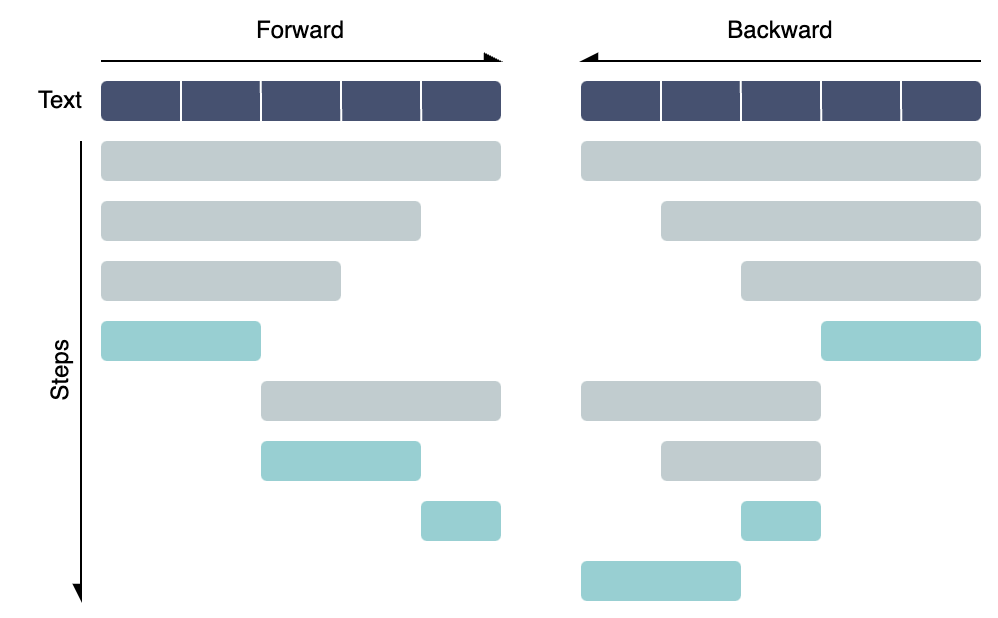
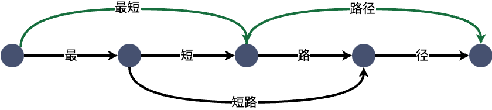

# 摘要

本次实验主要目标是利用课程中学过的双向最大匹配算法、最少分词法（最短路径法），在给定的PKU词典 `pku_training_words.utf8` 的帮助下，分别对数据集 `corpus.txt` 进行分词。并滤除停用词将分词表 `stop_word.txt` 结果与真实的分词结果文件 `gold.txt` 进行对比，计算出精确率P、召回率R和F1值。最后绘制一个词云图，展示分词结果中各词的频率。

# 理论背景

分词任务是中文自然语言处理中的一个基本问题，是将连续的字序列切分成具有语言学意义的词序列的过程。分词是中文自然语言处理的基础，对于中文信息处理、文本挖掘、信息检索等领域都有着重要的意义。

简单来说，分词阶段，我们将利用训练好得到的词典（语料库中所有有语义的词语），对给定的文本进行分词。在评估阶段，我们要滤除停用词（停用词是一些我们不那么关心的词，如：标点符号、助词、语气词，等简单词），将分词结果与真实的分词结果进行对比，计算出精确率P、召回率R和F1值。

在获得词典后，按照实验要求，我们将使用有词典切分、基于规则的方法中的双向最大匹配算法和最少分词法两种方法进行分词。下面简单介绍这两种方法：

## 双向最大匹配算法

双向最大匹配算法是一种基于词典的分词算法。所谓双向匹配，其基本思想是：从左向右和从右向左分别扫描文本，分别执行最大匹配算法，然后在前向和后向结果中取两者中分词数量较少的那个作为最终的分词结果，如果一样则取单词较少的。这种方法的优点是简单、高效。

而其中的前向（后向）最大匹配算法，则是每遇到一个字，都尝试从字典中向后（向前）匹配最长的词。大致原理可用以下示意图表示：



## 最少分词法（最短路径法）

最少分词法是一种基于最短路径的分词算法。其基本思想是：将文本看作一个有向无环图，每个节点代表一个分词位置，每个边代表一个可行的分词（如单字词或词典词）。然后通过最短路径算法找到最短路径，即最少分词的结果。而由于这里是在有向无环图上进行最短路径搜索，所以可以使用动态规划算法来实现。

一个简单的示意图如下：



# 实验

## Data Preparation

首先读入词典文件 `pku_training_words.utf8`，和停用词表 `stop_word.txt`，并将其存入 `set` 中，以便后续查找。

```python
def read_dict(path):
    dic = set()
    with open(path, 'r', encoding='utf-8') as f:
        for line in f:
            dic.add(line.strip())
    return dic

# 读取字典：data/词典/pku_training_words.utf8，一行一个词
dic = read_dict('data/词典/pku_training_words.utf8')

# 读取停词表：data/停用词/stop_word.txt，一行一个词
stop_words = read_dict('data/停用词/stop_word.txt')
```

再读入待分词数据集 `corpus.txt`，并将其存入 `list` 中，以便后续处理。

```python
with open('data/待分词文件/corpus.txt', 'r', encoding='utf-8') as f:
    text = f.readlines()
```

## Algorithm Implementation

### 双向最大匹配算法

首先实现双向最大匹配算法，这里我们使用前向最大匹配算法和后向最大匹配算法，然后在前向和后向结果中取两者中分词数量较少的那个作为最终的分词结果。

```python
import sys
from collections import defaultdict

# 双向最大匹配算法

def forward_mma(text, dic, stop_words): # 前向
    result = []  # 存储分词结果
    max_len = max(len(w) for w in dic)  # 词典中最长词的长度
    i = 0  # 当前扫描位置

    while i < len(text):
        found = False  # 标记是否找到匹配词
        # 从最大长度开始尝试匹配
        for j in range(min(max_len, len(text)-i), 0, -1):
            # 如果当前子串在词典中
            if text[i:i+j] in dic:
                result.append(text[i:i+j])  # 将匹配词加入结果
                i += j  # 移动扫描位置
                found = True  # 标记找到匹配词
                break  # 退出内层循环
        if not found:
            # 如果没有找到匹配词，将当前字符作为单独的词加入结果
            result.append(text[i])
            # 移动扫描位置
            i += 1
    return result

def backward_mma(text, dic, stop_words): # 后向

    # 与前向相同，只是扫描方向相反，这里略去，详见代码 ws.ipynb

    pass

def bi_mma(text, dic, stop_words):
    result_forward = forward_mma(text, dic, stop_words)
    result_backward = backward_mma(text, dic, stop_words)

    # 比较前向和后向的结果，取单词较少的那个
    if len(result_forward) < len(result_backward):
        return result_forward
    elif len(result_forward) > len(result_backward):
        return result_backward
    else:
        # 比较单字的数量，取单字较少的那个
        count_forward = sum(1 for w in result_forward if len(w) == 1)
        count_backward = sum(1 for w in result_backward if len(w) == 1)
        if count_forward < count_backward:
            return result_forward
        else:
            return result_backward
```

### 最少分词法（最短路径法）

然后实现最少分词法，这里我们将文本看作一个有向无环图，每个节点代表一个分词位置，每个边代表一个可行的分词（如单字词或词典词）。然后通过最短路径算法找到最短路径，即最少分词的结果。

```python
# 构建DAG
def build_dag(text, dic):
    dag = defaultdict(list)
    n = len(text)

    # 遍历词典中所有可能的分词，将其加入 DAG
    max_len = max(len(w) for w in dic)
    for i in range(n):
        for j in range(i + 1, min(i + max_len + 1, n + 1)):
            if text[i:j] in dic:
                dag[i].append(j)

    # 处理单字词，即每两个相邻节点之间加一条边
    for i in range(n):
        if len(dag[i]) == 0:
            dag[i].append(i + 1)
    return dag

# 动态规划求最短路径
def shortest_path(text, dag, dic):
    n = len(text)
    dp = [2147483647] * (n + 1)
    pre = [-1] * (n + 1)
    
    dp[0] = 0
    
    for i in range(n):
        for j in dag[i]:
            if dp[i] + 1 < dp[j]:
                dp[j] = dp[i] + 1
                pre[j] = i
    
    result = []
    i = n
    while i > 0:
        result.append(text[pre[i]:i])
        i = pre[i]
    
    result.reverse()

    return result

# 最少分词法（最短路径分词）
def sp_ma(text, dic, stop_words):
    dag = build_dag(text, dic)
    return shortest_path(text, dag, dic)
```

## Evaluation

最后实现评估函数，计算精确率P、召回率R和F1值，注意滤除停用词。

这里需要做一个思路转换，由于分词长度不一定，所以我们在计算 Metrics 时，可以将分词结果和真实结果转换为区间的集合，然后通过计算集合的交集和并集来计算 P、R 和 F1。

```python
def get_intervals(words): # 将分词结果转换为区间集合
    intervals = []
    start = 0
    for word in words:
        if word not in stop_words: # 滤除停用词
            end = start + len(word)
            intervals.append((start, end))
            start = end
        else:
            start += len(word)
    return intervals

def evaluate(result, gold):
    true_intervals = [] # 真实分词结果的区间集合
    pred_intervals = [] # 预测分词结果的区间集合

    # 处理结果为一行字符串
    result = ' '.join([' '.join(line.strip().split()) for line in result])
    gold = ' '.join([' '.join(line.strip().split()) for line in gold])
    
    # 将分词结果转换为区间集合
    true_intervals.extend(get_intervals(gold.strip().split()))
    pred_intervals.extend(get_intervals(result.strip().split()))
    
    # 计算 P、R 和 F1
    true_intervals = set(true_intervals)
    pred_intervals = set(pred_intervals)
    
    # 计算 true positives, false positives, 和 false negatives
    tp = len(true_intervals & pred_intervals)
    fp = len(pred_intervals - true_intervals)
    fn = len(true_intervals - pred_intervals)
    
    # 计算 precision, recall, and F1 score
    precision = tp / (tp + fp) if (tp + fp) > 0 else 0
    recall = tp / (tp + fn) if (tp + fn) > 0 else 0
    f1 = 2 * precision * recall / (precision + recall) if (precision + recall) > 0 else 0
    
    return precision, recall, f1
```

## Results

最后我们将实现的算法应用到数据集上，并计算出 P、R 和 F1 值。

| Algorithm | Precision | Recall | F1 |
| --- | --- | --- | --- |
| 双向最大匹配算法 | 0.7712990936555891 | 0.8608468801022219 | 0.8136164645498918 |
| 最少分词法 | 0.7717278985104049 | 0.8615035138780436 | 0.814148309028855 |

此外我还根据分词结果绘制了一个词云图，展示了分词结果中各词的频率。通过词云图我们可以看到，分词结果中一些常见的词语，如“中国”、“发展”、“国家”等，这些词语在文本中出现的频率较高。


# 实验心得

本次实验主要是对分词任务的实现和评估。通过实现双向最大匹配算法和最少分词法，我们可以看到这两种方法在 PKU 词典上的表现都不错，F1 值都在 0.8 左右。这说明这两种方法在分词任务上有着不错的表现。